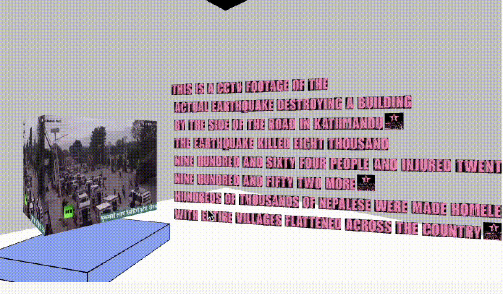

# The Earthquake Museum (11:56 25 APRIL 2015)
An interactive website that hosts different stories from the mega-earthquake that struck Nepal in 2015. 
Commissioned by The Nepali Times (whose stories have been used to populate the site).

# The Stages of Development
The project went through several stages until completion, as I always wanted to commemorate what happened in 2015 on the web. Giving a space to the tragedy, how it made the nation come together and the eventual reformations we made.

## The Super Initial Stage
An early prototype for this idea was built as a school project. I created a basic 3D space where you could walk to different objects and interact with them via getting close to them. Stock images and text would appear stating what happened to the given object during the earthquake, and an mp3 would also play.
You can access the experience below (built through `p5.js`). Just click the Run or the Play icon you see on the top left:

https://editor.p5js.org/Aadhar/sketches/B2vlUDi8s 

## After The Nepali Times Approached
They sparked the idea of building the Dharahara (a monument that the earthquake devoured but was rebuilt) while interacting with the site. I was intrigued by that and started experimenting in p5.js, the result of which is below:

https://editor.p5js.org/Aadhar/sketches/Zip4AB-DL

## The Final Spark
I wasn't really satisfied with the direction I was moving towards and wandering aimlessly on the internet when I stumbled across the website below, which was about Greta Thunberg. It showed her 3D model in the middle as the stories spiraled around her. That really caught my eye and I switched to `THREE.js`, and started building a similar thing.
https://theyearofgreta.com/

Although not as clean as the original, I made a 3D model of the broken Dharahara and made the stories spiral around it. The final result is in the site below:
https://nepalitimes.github.io/earthquake/page1.html 

